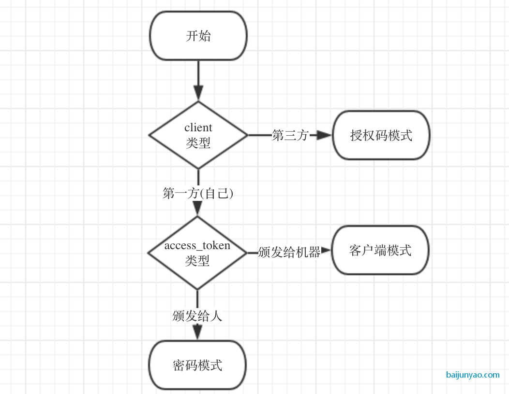

四种授权类型:

- 授权码
- 隐式(implicit)
- 资源属主密码凭证
- 客户端凭证

### 授权码模式

授权码模式 (Authorization Code) 是最常见的 OAuth 授权类型;

### Implicit Grant

隐式授权类型用于获取访问令牌（它没有支持发布刷新令牌），并针对公共已知操作特定重定向 URI 的客户端。这些客户通常在浏览器中使用脚本语言实现，例如 JavaScript。

4 个步骤:
A). 客户端初始化流程，把资源属主的 user-agent 定向到授权端点.
客户端包含 client 标识符, 请求 scope, 本地状态, 还有一个重定向 URI

B). 授权服务器认证资源属主(通过 user-agent)

C). 假设资源属主获得了访问，授权服务器重定向 user-agent 到给定 URI. 重定向 URI 中包含 access token.

D. user-agent 发送 web 请求

E. web 服务器返回 web 页面.

F. user-agent 执行 web 服务器返回的脚本，在本地提取访问令牌

G. user-agent 传递 access token 给 client

#### 总结

我们跟授权码对比可以发现；
简化模式没有获取 code 的步骤；
整个过程我们只传递了 client_id ；
但是并没有传递 client_secret ；
那么也就无法验证 client 的真实性；
简化模式没有授权码模式安全；
获得的 token 只有 access_token 没有 refresh token；
而且 access_token 的过期时间设置的比较短；
因此现在不建议使用简化模式；

### 资源属主密码凭证

### 客户端模式 Client Credentials

## 总结

### 获取 access_token 的方式

- 授权码模式(Authorization Code)：先用账号密码登录获取 code ；然后使用 code 获取 access_token ； -简化模式(也叫隐式授权)(Implicit)： 使用账号密码直接在浏览器通过重定向获取 access_token ；
- 密码模式(Resource Owner Password Credentials)： Client 直接使用账号密码获取 access_token ；
- 客户端模式(Client Credentials)： 直接生成 access_token ；一般用于机器之间；

### access_token 是颁发给人还是机器

- 颁发给人，跟用户关联： 授权码模式、密码模式、简化模式；
- 颁发给机器，跟用户无关： 客户端模式；

### 是否有 refresh_token

- 有 refresh_token ： 授权码模式、密码模式 ；
- 无 refresh_token ： 简化模式、客户端模式；

### 给第三方还是自己使用

- 给第三方： 授权码模式 ；
- 给自己： 密码模式、简化模式、客户端模式；

参考

